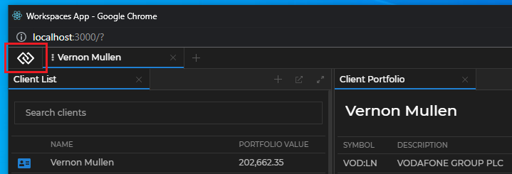
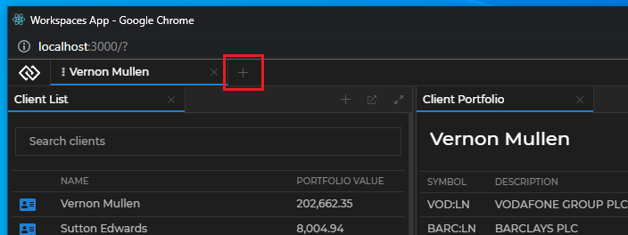
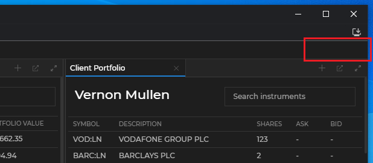
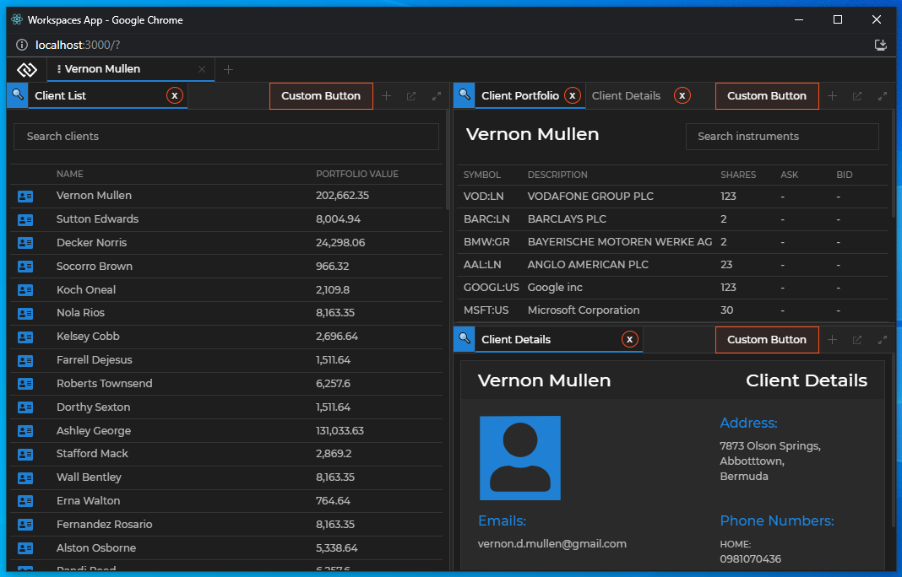

## Workspaces App

The Workspaces App (or [Frame](../overview/index.html#workspaces_concepts-frame)) is mandatory for using any Workspaces functionality. For [**Glue42 Core**](https://glue42.com/core/) projects you have to create your own Workspaces App using the [`@glue42/workspaces-ui-react`](https://www.npmjs.com/package/@glue42/workspaces-ui-react) library which provides all functionalities necessary for building a Workspaces App as a single React component - `<Workspaces />`. The `<Workspaces />` component provides extensibility points for passing custom components to it and can also be wrapped in other components (see [Workspaces Component](#workspaces_component)). The library enables you to use custom system popups, create your own popups from HTML elements (see [Custom Popups](#custom_popups)) and compose the content of a Workspace (see [Composing Workspace Content](#composing_workspace_content)).

Hot module reloading is supported, but keep in mind that each refresh closes all apps and Workspaces in the Frame.

*Use the [Workspaces App template](https://github.com/Glue42/templates/tree/master/workspaces-react) provided in the [**Glue42 Core**](https://glue42.com/core/) GitHub repo as a startup skeleton to create and customize your own Workspaces App.*

## Header Elements

The Header Element of the Workspaces App isn't available as a single customizable component, but contains several customizable elements:

- Logo element;
- Add Workspace element;
- System Buttons element;

*Note that, by default, there is a Move Area element located between the Add Workspace and the System Buttons elements. In a [**Glue42 Enterprise**](https://glue42.com/enterprise/) project, this element allows the user to move the Workspaces App, but in a [**Glue42 Core**](https://glue42.com/core/) project, the browser prevents its default functionality.*

The Logo element is located at the leftmost part of the header area, to the left of the Workspace tabs, and hosts the `<GlueLogo />` component. By default, it renders the Glue42 logo:



The Add Workspace element is located right after the Workspace tabs and hosts the `<AddWorkspaceButton />` component. By default, it renders the "+" button that opens the Add Workspace popup:



The System Buttons element is located at the rightmost part of the header area and can host any custom buttons. By default, this element is empty (there are no "Minimize", "Maximize" or "Close" buttons), because the browser prevents the default functionality of the system buttons:



The following demonstrates the default structure of the Header element:

```javascript
<>
    <GlueLogo />
    <>
        <WorkspaceTab />
    </>
    <AddWorkspaceButton />
    <MoveArea />
    <></>
</>
```

## Group Header Elements

The Group Header element contains the header of a tab window group within a Workspace:


The Group Header element isn't available as a single customizable component, but contains several customizable elements and zones. One or more Workspace Window Tab elements hold the individual tabs and the Group Header Buttons element holds the standard buttons for a window group in a Workspace ("Add Window", "Eject", "Maximize", "Restore"). There are two additional customizable zones that are located before and after the tabs:


Each Workspace Window Tab element hosts an individual `<WorkspaceWindowTab />` component. Each `<WorkspaceWindowTab />` component contains the `<WorkspaceWindowChannelsLink />`, `<WorkspaceWindowTabTitle />` and `<WorkspaceWindowTabCloseButton />` components. The Group Header Buttons element hosts the `<GroupHeaderButtons />` component. The following demonstrates the default structure of the `<WorkspaceWindowTab />` and the `<GroupHeaderButtons />` components:

```javascript
<WorkspaceWindowTab>
    <WorkspaceWindowChannelsLink />
    <WorkspaceWindowTabTitle />
    <WorkspaceWindowTabCloseButton />
</WorkspaceWindowTab>

<GroupHeaderButtons>
    <AddWindowButton />
    <EjectButton />
    <RestoreGroupButton />
    <MaximizeGroupButton />
</GroupHeaderButtons>
```

## Using the Components

All default components can be reused and composed with custom code. If usage of such component has been detected, its default behavior will be applied. For instance, if you use the `<AddWorkspaceButton />` component, a popup will automatically appear when the button is clicked, without the need of custom code to induce this behavior. If you pass the same component more than once, an error will be thrown.

To remove a component and make the respective element empty, pass a `<Fragment />` component.

There are several prerequisites when creating a custom Workspaces App:

- The `<Workspaces />` component accepts the size of its container. If it is nested in another component, the parent component must have its `height` style property set to `100%` in order for the `<Workspaces />` component to be visible.
- The `@glue42/workspaces-ui-react` library depends on the `glue` object returned by the [initialized Glue42 Web library](../../../../developers/core-concepts/web-client/javascript/index.html#initialization). If you have used the [Glue42 React Hooks](../../../../developers/core-concepts/web-client/react/index.html) wrapper to obtain the `glue` object, or if you have attached the `glue` object to the global `window` object, it will be automatically passed to the `<Workspaces />` component as a prop. Otherwise, you must pass it manually.
- The CSS files must be added manually (see [Styles](#styles)).

## Workspaces Component

The `<Workspaces />` component has two props - `glue` and `components`. The `glue` prop expects the `glue` object returned by the initialized Glue42 library. The `components` prop is used to define the header components (see [Header Components](#header_components)), the system popup components or apps (see [Replacing the System Popups](#custom_popups-replacing_the_system_popups)) and the Workspace content to be rendered (see [Composing Workspace Content](#composing_workspace_content)).

*It is important to note that the `<Workspaces>` component isn't meant to be used as a typical React component. Besides its rendering responsibilities, it also contains heavy logic. This component is meant to allow you to create a dedicated Workspaces App which must function as a standalone window - you must never use it as part of another app, as this will lead to malfunctioning. The Workspaces App should be customized only using the available extensibility points.*

The following example demonstrates the structure of the `<Workspaces />` component, its properties and default values:

```javascript
<Workspaces
    components={{
        header: {
            LogoComponent: GlueLogo,
            AddWorkspaceComponent: AddWorkspaceButton,
            WorkspaceTabComponent: () => {
                return (
                    <>
                        <WorkspaceIconButton />
                        <WorkspaceSaveButton />
                        <WorkspaceTitle />
                        <WorkspaceTabCloseButton />
                    </>
                );
            },
            SystemButtonsComponent: () => <></>
        },
        groupHeader: {
            WorkspaceWindowTabComponent: () => {
                return (
                    <>
                        <WorkspaceWindowChannelsLink />
                        <WorkspaceWindowTabTitle />
                        <WorkspaceWindowTabCloseButton />
                    </>
                );
            },
            ButtonsComponent: () => {
                return (
                    <>
                        <AddWindowButton />
                        <EjectButton />
                        <RestoreGroupButton />
                        <MaximizeGroupButton />
                    </>
                );
            },
            BeforeTabsComponent: () => <></>,
            AfterTabsComponent: () => <></>
        }
        popups: {
            SaveWorkspaceComponent: SaveWorkspacePopup,
            AddApplicationComponent: AddApplicationPopup,
            AddWorkspaceComponent: AddWorkspacePopup
        },
        WorkspaceContents: WorkspaceContents
    }}

    glue={glue}
/>
```

Wrapping the Workspaces App in a single React component allows you to place custom components around it. The following example demonstrates how easy it is to customize the Workspaces App with your own toolbar:

```javascript
import React from "react";
import Workspaces from "@glue42/workspaces-ui-react";
import MyCustomToolbar from "./MyCustomToolbar";

const App = () => {
    return (
        <div className="App">
            <MyCustomToolbar />
            <Workspaces />
        </div>
    );
};

export default App;
```

Adding a custom toolbar with buttons to the Workspaces App:


## Header Components

Use the default components for the header of the Workspaces App, or replace them with your custom ones. Compose more than one component in a [header element](#header_elements) by passing a function that returns a `<Fragment />` component.

### Logo

The following example demonstrates composing the Glue42 logo and a custom button in the Logo element:

```javascript
import React from "react";
import Workspaces, { GlueLogo } from "@glue42/workspaces-ui-react";
import CustomButton from "./CustomButton";

const App = () => {
    return (
        <div className="App">
            <Workspaces
                components={{
                    header: {
                        LogoComponent: () => <> <CustomButton /> <GlueLogo /> </>
                    }
                }}
            />
        </div>
    );
};

export default App;
```

Adding a custom button in the Logo element:


### Add Workspace

The following example demonstrates replacing the default Add Workspace component with a custom button:

```javascript
import React from "react";
import Workspaces from "@glue42/workspaces-ui-react";
import CustomButton from "./CustomButton";

const App = () => {
    return (
        <div className="App">
            <Workspaces
                components={{
                    header: {
                        AddWorkspaceComponent: CustomButton
                    }
                }}
            />
        </div>
    );
};

export default App;
```

Using a custom button for the Add Workspace component:


### Workspace Tab

*Note that the examples in this section use the [`<WorkspaceTab />`](https://github.com/Glue42/core/blob/master/packages/workspaces-ui-react/src/defaultComponents/workspace/WorkspaceTab.tsx) component. A [`<WorkspaceTabV2 />`](https://github.com/Glue42/core/blob/master/packages/workspaces-ui-react/src/defaultComponents/workspace/tabV2/WorkspaceTabV2.tsx) component is also available - its structure differs from the `<WorkspaceTab />` component, as it contains a [Lock Settings UI](../enabling-workspaces/index.html#main_app-lock_settings) for the Workspace. Both components are supported.*

The contents of the `<WorkspaceTab />` component can be modified by replacing the default `<WorkspaceIconButton />`, `<WorkspaceSaveButton />`, `<WorkspaceTitle />` and `<WorkspaceTabCloseButton />` components it contains. You can provide a custom icon to be used when the [Workspace is pinned](../workspaces-api/index.html#workspace-pinning__unpinning_workspaces), a custom Save button for the Workspace tab, a custom Workspace title, and a custom "Close" button for the Workspace tab.

The following example demonstrates composing a custom Workspace Tab component using the default `<WorkspaceSaveButton />` and `<WorkspaceIconButton />` components, as well as a custom title and a custom "Close" button for the Workspace tab. The example also shows how to hide and show conditionally the Workspace Tab contents based on whether the Workspace is pinned:

```javascript
import React, { useState } from "react";
import { WorkspaceIconButton, WorkspaceSaveButton } from "@glue42/workspaces-ui-react";
import CustomTitle from "./CustomTitle";
import CustomCloseButton from "./CustomCloseButton";

const CustomWorkspaceTab = ({ isPinned, title, onCloseClick, onSaveClick, icon, showSaveButton, showCloseButton }) => {
    return (
        <div className="my-custom-workspace-tab">
            {isPinned ? <WorkspaceIconButton icon={icon} /> : showSaveButton && <SaveButton showSavePopup={onSaveClick} />}
            {!isPinned && <CustomTitle title={title} />}
            {(!isPinned && showCloseButton) && <CustomCloseButton close={onCloseClick} />}
        </div>
    );
};

export default CustomWorkspaceTab;
```

Use the props received by the `<WorkspaceTab />` component to:

- preserve the default component behavior (closing the Workspace tab, saving the Workspace Layout) or define a custom behavior;
- determine which components to show or hide based on whether the [Workspace is pinned](../workspaces-api/index.html#workspace-pinning__unpinning_workspaces);

The following example demonstrates replacing the default Workspace Tab component:

```javascript
import React from "react";
import Workspaces from "@glue42/workspaces-ui-react";
import CustomWorkspaceTab from "./CustomWorkspaceTab";

const App = () => {
    return (
        <Workspaces
            components={{
                header: {
                    WorkspaceTabComponent: CustomWorkspaceTab
                }
            }}
        />
    );
};

export default App;
```

### System Buttons

The following example demonstrates adding a custom button in the System Buttons element:

```javascript
import React from "react";
import Workspaces from "@glue42/workspaces-ui-react";
import CustomButton from "./CustomButton";

const App = () => {
    return (
        <div className="App">
            <Workspaces
                components={{
                    header: {
                        SystemButtonsComponent: <CustomButton />
                    }
                }}
            />
        </div>
    );
};

export default App;
```

Adding a custom button in the System Buttons element:


## Group Header Components

Use the default Group Header components, or provide your own components to customize the Group Header elements and zones.

The following image demonstrates a Group Header with custom:

- Workspace Window Tab element containing a custom "Close" button;
- Group Header Buttons element containing a custom button;
- Before Tabs zone containing a custom icon;



To customize the Group Header elements and zones, use the `groupHeader` property of the `components` object in the `<Workspaces />` component.

### Workspace Window Tab

The following examples demonstrate creating a Workspace Window Tab component with customized "Close" button while keeping the default Channel Selector and title format.

When creating a custom "Close" button (or any custom element in the Workspace Window Tab that requires the user to click on it), you must consider preventing the `"mousedown"` and/or `"click"` events so that they won't be processed by the Workspaces framework. Otherwise, when the user holds down the mouse button on that element, the window tab will enter draggable mode.

Creating a custom "Close" button with the default closing functionality by using the respective prop:

```javascript
import React, { useEffect, useRef } from "react";

const CustomCloseButton = ({ close }) => {
    const ref = useRef(null);

    useEffect(() => {
        if (!ref.current) { return };

        // Stop the propagation of the `"mousedown"` event,
        // in order to prevent the Workspaces framework from processing it.
        ref.current.onmousedown = e => e.stopPropagation();
    }, [ref]);

    return <button ref={ref} onClick={() => close()}>x</button>
};

export default CustomCloseButton;
```

*Note that due to the nature of the Workspaces App and the fact that React event handlers are always executed after the native DOM event handlers, you must use a direct reference to the DOM elements instead of React events when handling the `"mousedown"` and `"click"` events.*

Using the custom "Close" button in the Workspace Window Tab component. To preserve the default component functionalities, remember to pass the respective props to the components:

```javascript
import React from "react";
import {
    WorkspaceWindowChannelsLink,
    WorkspaceWindowTabTitle,
    WorkspaceWindowTabCloseButton
} from "@glue42/workspaces-ui-react";
import CustomCloseButton from "./CustomCloseButton";

const CustomWorkspaceWindowTab = ({ channels, title, close }) => {
    return (
        <>
            <WorkspaceWindowTabTitle title={title} />
            {close.visible && <CustomCloseButton {...close} />}
        </>
    );
};

export default CustomWorkspaceWindowTab;
```

Using the custom Workspace Window Tab component in the Group Header element of your custom Workspaces App:

```javascript
import React from "react";
import Workspaces from "@glue42/workspaces-ui-react";
import CustomWorkspaceWindowTab from "./CustomWorkspaceWindowTab";

const App = () => {
    return (
        <Workspaces
            components={{
                groupHeader: {
                    WorkspaceWindowTabComponent: CustomWorkspaceWindowTab
                }
            }}
        />
    );
};

export default App;
```

### Group Header Buttons

The following example demonstrates creating a Group Header Buttons component containing a custom button and the standard tab window group buttons. To preserve the default component functionalities, remember to pass the respective props to the components:

```javascript
import React from "react";
import {
    AddWindowButton,
    EjectButton,
    MaximizeGroupButton,
    RestoreGroupButton
} from "@glue42/workspaces-ui-react";

const CustomGroupHeaderButtons = ({ addWindow, eject, restore, maximize }) => {
    return (
        <>
            <button>Custom Button</button>
            {addWindow.visible && <AddWindowButton {...addWindow} />}
            {eject.visible && <EjectButton {...eject} />}
            {restore.visible && <RestoreGroupButton {...restore} />}
            {maximize.visible && <MaximizeGroupButton {...maximize} />}
        </>
    );
};

export default CustomGroupHeaderButtons;
```

Using the custom Group Header Buttons component in the Group Header element of your custom Workspaces App:

```javascript
import React from "react";
import Workspaces from "@glue42/workspaces-ui-react";
import CustomWorkspaceWindowTab from "./CustomWorkspaceWindowTab";
import CustomGroupHeaderButtons from "./CustomGroupHeaderButtons";

const App = () => {
    return (
        <Workspaces
            components={{
                groupHeader: {
                    WorkspaceWindowTabComponent: CustomWorkspaceWindowTab,
                    ButtonsComponent: CustomGroupHeaderButtons
                }
            }}
        />
    );
};

export default App;
```

### Zones

The following example demonstrates creating a custom component for the Before Tabs zone of the Group Header element:

```javascript
import React from "react";

const CustomBeforeTab = () => {
    return <div>&#128269;</div>
};

export default CustomBeforeTab;
```

Using the custom component for the Before Tabs zone in the Group Header element of your custom Workspaces App:

```javascript
import React from "react";
import Workspaces from "@glue42/workspaces-ui-react";
import CustomWorkspaceWindowTab from "./CustomWorkspaceWindowTab";
import CustomGroupHeaderButtons from "./CustomGroupHeaderButtons";
import CustomBeforeTab from "./CustomBeforeTab";

const App = () => {
    return (
        <Workspaces
            components={{
                groupHeader: {
                    WorkspaceWindowTabComponent: CustomWorkspaceWindowTab,
                    ButtonsComponent: CustomGroupHeaderButtons,
                    BeforeTabsComponent: CustomBeforeTab
                }
            }}
        />
    );
};

export default App;
```

## Custom Popups

The library allows you to customize the system popups of the Workspaces App, as well as to create custom popups for your apps participating in the Workspace.

Using a custom button and a custom popup for the Add Workspace component:


### Replacing the System Popups

The `components` prop of the `<Workspaces />` component has a `popups` property that enables you to pass custom components or Glue42 apps that will act as system popups. To specify a custom Glue42 app as a system popup, pass its name as a string.

*Note that if you decide to use the default system popups, you must ensure that they receive their required props. This includes a `glue` object with initialized [Workspaces](../workspaces-api/index.html) library and [App Management](../../../application-management/index.html) library initialized in `"full"` or `"skipIcons"` mode.*

The following example demonstrates how to pass default popup components and their props correctly and how to pass a custom Glue42 app as a popup:

```javascript
import React from "react";
import Workspaces, {
    SaveWorkspacePopup,
    AddApplicationPopup
} from "@glue42/workspaces-ui-react";

const App = () => {
    return (
        <div className="App">
            <Workspaces
                components={{
                    popups: {
                        // Props are passed automatically.
                        SaveWorkspaceComponent: SaveWorkspacePopup,
                        // You must pass the props explicitly to the component and spread them.
                        AddApplicationComponent: props => <AddApplicationPopup {...props} />,
                        // Specifying a custom Glue42 app as a system popup.
                        AddWorkspaceComponent: "custom-add-workspace-popup"
                    }
                }}
            />
        </div>
    );
};

export default App;
```

Each system popup component receives several default props - functions for resizing and hiding the popup, as well as props for identifying the Frame, the Workspace or the Workspace element where the popup is located.

Save Workspace component:

| Prop | Signature | Description |
|------|-----------|-------------|
| `resizePopup` | `(s: Size) => void` | Function for resizing the popup. Accepts a required `Size` object as a parameter with optional `height` and `width` properties. |
| `hidePopup` | `() => void` | Function for hiding the popup. |
| `workspaceId` | `string` | The ID of the Workspace that will be saved. |
| `glue` | `any` | *Optional*. The Glue42 JavaScript library object. |

Add Workspace component:

| Prop | Signature | Description |
|------|-----------|-------------|
| `resizePopup` | `(s: Size) => void` | Function for resizing the popup. Accepts a required `Size` object as a parameter with optional `height` and `width` properties. |
| `hidePopup` | `() => void` | Function for hiding the popup. |
| `frameId` | `string` | The ID of the Frame in which the Workspace will be created or loaded. |
| `glue` | `any` | *Optional*. The Glue42 JavaScript library object. |

Add Application component:

| Prop | Signature | Description |
|------|-----------|-------------|
| `resizePopup` | `(s: Size) => void` | Function for resizing the popup. Accepts a required `Size` object as a parameter with optional `height` and `width` properties. |
| `hidePopup` | `() => void` | Function for hiding the popup. |
| `filterApps` | `(app: Glue42.AppManager.Application) => bool` | Property expecting a user-defined predicate for filtering the apps that will be available in the "Add Application" popup menu. |
| `workspaceId` | `string` | The ID of the Workspace in which the app will be added. |
| `boxId` | `string` | The ID of the Workspace element in which the app will be added. |
| `glue` | `any` | *Optional*. The Glue42 JavaScript library object. |

The following example demonstrates a reference implementation of a custom system popup component and how to handle resizing and hiding the popup:

```javascript
import React, { useEffect } from "react";

const SaveWorkspacePopup = ({ resizePopup, hidePopup }) => {
    const containerRef = React.createRef();
    const refreshHeight = () => {
        if (!containerRef?.current) {
            return;
        }

        const bounds = containerRef.current.getBoundingClientRect();

        resizePopup({
            height: bounds.height,
            width: bounds.width
        });
    };

    useEffect(() => {
        refreshHeight();
    }, []);

    return (
        <div onClick={(e) =>e.stopPropagation()} ref={containerRef}>
            Custom Popup
            <button onClick={hidePopup}>Hide</button>
        </div>
    );
};

export default SaveWorkspacePopup;
```

The following example demonstrates how to use the default `<AddApplicationPopup />` system popup and filter the apps that will be available in the "Add Application" menu by a custom user-defined property:

```javascript
import React from "react";
import Workspaces { AddApplicationPopup } from "@glue42/workspaces-ui-react";
import "@glue42/workspaces-ui-react/dist/styles/popups.css";
import "@glue42/workspaces-ui-react/dist/styles/goldenlayout-base.css";
import "@glue42/workspaces-ui-react/dist/styles/glue42-theme.css";
import "./index.css";

const App = () => {
    // The custom properties from your app configuration are accessible through
    // the `userProperties` property of the `Application` object passed to the predicate function.
    const appFilter = app => app.userProperties.customAppFilterProperty;

    return (
        <Workspaces
            components={{
                popups:{
                    AddApplicationComponent: props => <AddApplicationPopup {...props} filterApps={appFilter} />
                }
            }}
        />
    );
};

export default App;
```

### User Defined Popups

There are two ways for you to create custom popups from HTML elements - by using the `<WorkspacePopup />` component, or by using the `useWorkspacePopup()` and `useWorkspaceWindowClicked()` hooks.

The `<WorkspacePopup />` component is based on the popular [`reactjs-popup`](https://www.npmjs.com/package/reactjs-popup) library. All features of the library are supported with the addition of two new properties:

| Property | Type | Description |
|----------|------|-------------|
| `innerContentStyles` | `object` | Value for the `style` property of the element that wraps the popup content. |
| `popupRef` | `React.RefObject<PopupActions>` | Ref to the `reactjs-popup` popup element. |

The following example demonstrates how to create a custom popup using the `<WorskpacePopup />` component:

```javascript
import React from "react";
import { WorkspacePopup } from "@glue42/workspaces-ui-react";

const CustomPopup = ({ trigger }) => {
    const popupRef = React.createRef();

    return (
        <WorkspacePopup innerContentStyle={{ height:300 }} popupRef={popupRef} trigger={trigger}>
            <div style={{ backgroundColor:"blue", height:"100%" }}>
                Custom Popup
                <button onClick={() => popupRef.current?.close()}>Close</button>
            </div>
        </WorkspacePopup>
    );
};

export default CustomPopup;
```

The other way to create a popup is to implement a custom popup element and use the `useWorkspacePopup()` and/or `useWorkspaceWindowClicked()` hooks.

- `useWorkspacePopup()` - accepts the ref object to the HTML element of the popup as a parameter;

*Note that this hook is meant to be used mainly in [**Glue42 Enterprise**](https://glue42.com/enterprise/) projects to ensure Windows 7 compatibility. It returns an array of two functions - the first one is to manually notify [**Glue42 Enterprise**](https://glue42.com/enterprise/) that the popup has been resized and the second one is to manually notify [**Glue42 Enterprise**](https://glue42.com/enterprise/) that the popup has been hidden. In a [**Glue42 Core**](https://glue42.com/core/) project these functions are irrelevant and won't throw an error if used.*

```javascript
const popupRef = React.createRef();
const [popupResized, popupHidden] = useWorkspacePopup(popupRef);
```

- `useWorkspaceWindowClicked()` - accepts a callback that is invoked when a window in the Frame is focused. A generic `onClick` event won't work for handling window clicks, because although the Workspaces App is a web app, it contains different apps from different processes. The hook returns an unsubscribe function, however, this unsubscribe function is called when the component is unmounted so implementing cleanup logic is usually unnecessary;

The following example demonstrates how to create a custom popup using the `useWorkspacePopup()` and `useWorkspaceWindowClicked()` hooks:

```javascript
import React from "react";
import {
    useWorkspacePopup,
    useWorkspaceWindowClicked
} from "@glue42/workspaces-ui-react";

const CustomPopup = ({ closePopup }) => {
    const popupRef = React.createRef();

    useWorkspacePopup(popupRef);
    useWorkspaceWindowClicked(closePopup);

    return (
        <div ref={popupRef} style={popupStyle}>
            Custom Popup
            <button onClick={closePopup}>Close</button>
        </div>
    );
};

const popupStyle = {
    backgroundColor:"blue",
    height:100,
    position:"fixed",
    zIndex:99,
    top:100,
    left:100,
    width:100
};

export default CustomPopup;
```

## Composing Workspace Content

The `components` prop of the `<Workspaces />` component has a `WorkspaceContents` property that enables you to manipulate the content of a Workspace - hide or show the Workspace content or add custom elements to the Workspace. For instance, you may need to render the Workspace content conditionally.

*Note that it isn't advisable to add complex components as additional Workspace content - the `WorkspaceContents` property is meant to allow you to add styling elements or interaction areas (simple toolbars, buttons, etc.) around the usual Workspace content.*

The `<WorkspaceContents />` component expects a Workspace ID as a prop.

*Note that you must never render simultaneously components containing the same Workspace ID, as this will lead to unexpected behavior.*

The following example demonstrates how to add a custom toolbar inside a Workspace and render it conditionally by clicking a custom button in the System Buttons element:

```javascript
import React, { useState } from "react";
import Workspaces, { WorkspaceContents } from "@glue42/workspaces-ui-react";
import CustomWorkspaceContent from "./CustomWorkspaceContent";

const App = () => {
    const [showContent, setShowContent] = useState(false);

    return (
        <Workspaces
            components={{
                header: {
                    SystemButtonsComponent: () => <button onClick={() => setShowContent(!showContent)}>Toggle Toolbar</button>
                },
                WorkspaceContents: props => showContent ?
                    <WorkspaceContents {...props} /> :
                    <> <CustomWorkspaceContent workspaceId={props.workspaceId}/> <WorkspaceContents {...props}/> </>
            }}
        />
    );
};

export default App;
```

Adding a custom toolbar as part of the Workspace content:


For a demonstration of using the `<WorkspaceContents />` component, see the [Pinned Workspace Tabs](https://github.com/Glue42/templates/tree/master/workspaces-react-pinned-tabs) example on GitHub. It shows how to render Workspace content conditionally using a button in the Workspaces header area.

## Styles

To use the default styles for your custom Workspaces App, import the following CSS files:

```javascript
import "@glue42/workspaces-ui-react/dist/styles/popups.css";
import "@glue42/workspaces-ui-react/dist/styles/goldenlayout-base.css";
import "@glue42/workspaces-ui-react/dist/styles/glue42-theme.css";
```

To use custom styles for the Workspaces App, simply import your CSS file after the default CSS imports to override them. The `goldenlayout-base.css` file is mandatory, but you may skip the `popup.css` or `glue42-theme.css` imports if you don't want to use the default styles for the system popups or the default Glue42 themes. Two default themes are available - **Day** and **Night** - and the trigger for switching between them is the class property of the `<html>` element - `"light"` for the **Day** theme and `"dark"` for the **Night** theme:

```html
<!-- Day theme -->
<html class="light">

<!-- Night theme -->
<html class="dark">
```